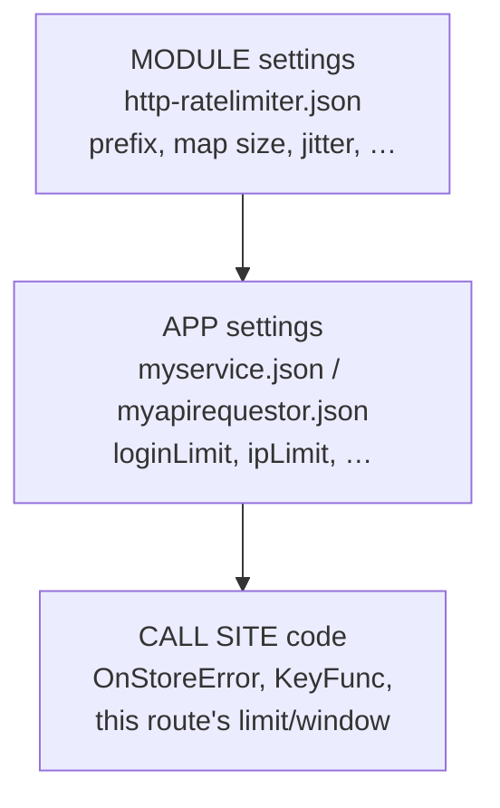
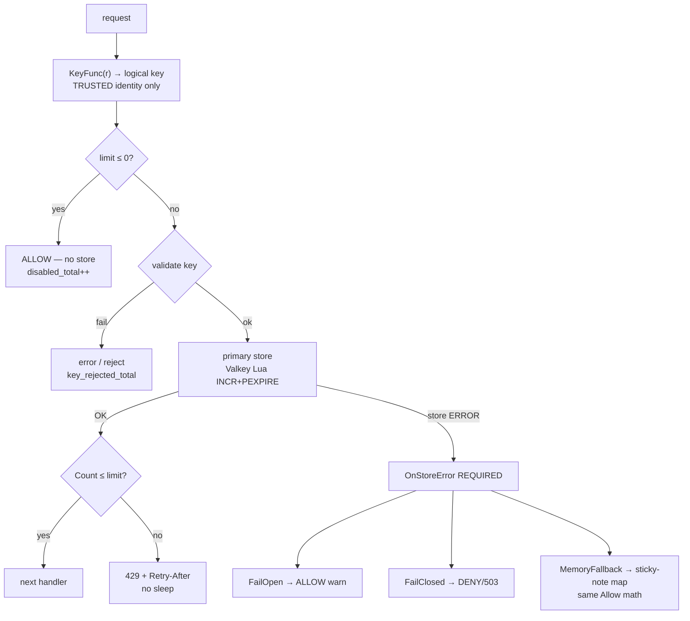
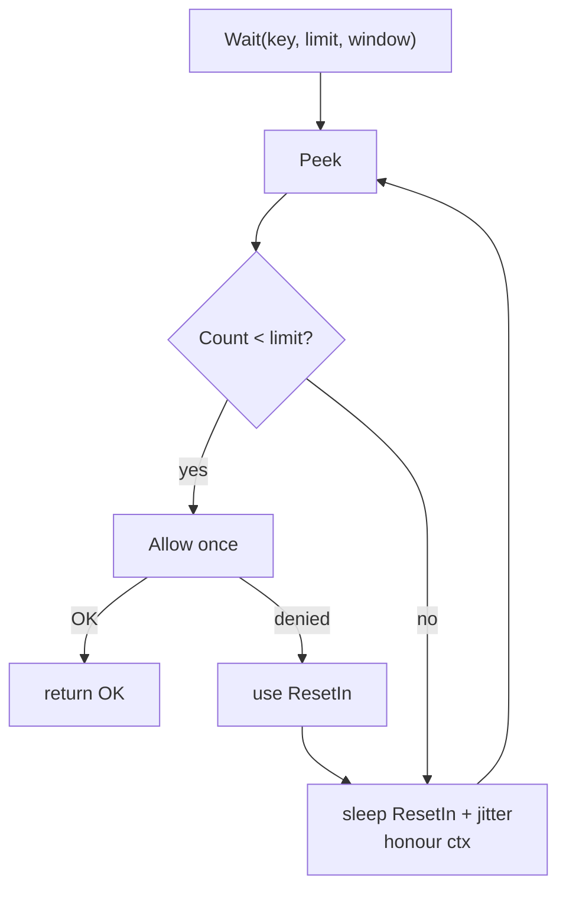
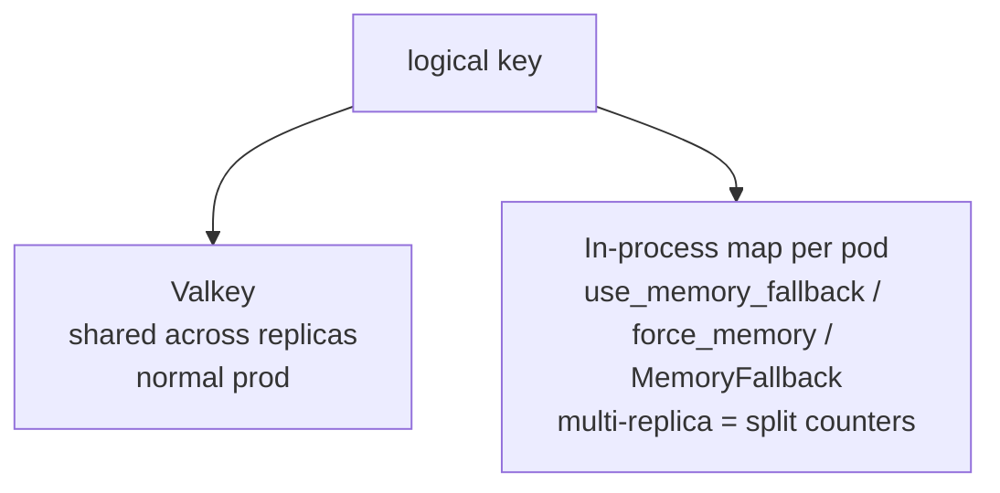

# caerus-framework-http-ratelimiter

[](https://github.com/caerus-framework/caerus-framework-http-ratelimiter/actions/workflows/ci.yml)
[](https://codecov.io/gh/caerus-framework/caerus-framework-http-ratelimiter)
[](LICENSE)

Caerus Framework HTTP Rate Limiter Component. Fixed-window rate limiting for
HTTP services and outbound clients, backed by a Valkey peer (default) with an
optional in-process sticky-note map (`use_memory_fallback` / `force_memory` /
`StorageMemoryFallback`). It owns the lifecycle, configuration (file + env +
flags), live reload of tunables, framework logging, and health/metrics — the
app supplies the per-call limit, window, key, and store-error policy.

**Choosing this module means configuring storage-error policy per call site.**
There is no silent fail-open: `Middleware` errors if `OnStoreError` is unset,
and `AllowWithPolicy` always takes an explicit policy argument (see
[Storage-error policy](#storage-error-policy)).

## What it is (and is not — yet)

| Is | Is not |
|---|---|
| **Fixed-window** counting with a Valkey `INCR` + `PEXPIRE` (TTL only set on the first increment) | Sliding window, token bucket, or leaky bucket (see below) |
| A stdlib `func(http.Handler) http.Handler` middleware plus `Allow`/`Reset`/`Peek`/`Wait` primitives | A router, a WAF, or a per-endpoint policy engine |
| A way to **pace your own outbound calls** (`Wait`: peek + interruptible sleep + jitter + allow once) | A way to slow down HTTP responses for attackers — answer **429 + Retry-After** instead |
| A rule about "how often" something may happen | A lock about "who owns it right now" — that is a different concern (see Recipe B) |

### Fixed window vs the others (same story, four machines)

Imagine the rule: **“at most 30 requests every 60 seconds.”**
Four common machines can enforce a sentence like that. They are **not** the
same machine. This module ships only the first.

| Machine | Picture for a 14-year-old | What “30 per 60s” really means | Nice part | Ugly part | This module? |
|---|---|---|---|---|---|
| **Fixed window** | A kitchen timer. When the first request arrives, you start a 60s countdown and put a tally mark for every request. When the timer hits zero, you throw the paper away and start over on the next request. | At most 30 tallies **inside one 60s timer run**. The timer is tied to that key’s TTL (here: set on the first `INCR`). | Dead simple. One counter + one expiry. Cheap in Valkey (`INCR` + `PEXPIRE`). Easy to reason about and to implement with Lua. | **Boundary burst:** use 30 at 0:59, timer ends, use 30 again at 1:00 → ~60 in two seconds that *cross* the boundary. The calendar does not care about your feeling of “one minute.” | **Yes — this is what we ship.** |
| **Sliding window** | A moving picture frame on a timeline. You always look at “the last 60 seconds from *now*,” not “the box that started when I first clicked.” | At most 30 requests whose timestamps fall inside the trailing 60s. | Matches how humans say “per minute.” Softens the fixed-window boundary spike. | Needs more memory or clever math (store timestamps, or approximate with weighted previous+current windows). Heavier than one counter. | **Not yet** |
| **Token bucket** | A jar of coins. Coins drip into the jar at a steady rate (refill). Each request spends one coin. If the jar is empty, you wait or get denied. The jar has a max size (burst). | Average rate ≈ refill speed; short bursts up to the jar size are allowed. | Great for “usually 30/min, but a small burst is OK.” Natural fit for pacing (`Wait` until a coin exists). | You must pick **rate + burst** carefully. Two numbers, not one “limit per window.” Harder to explain to product people. | **Not yet** |
| **Leaky bucket** | A funnel. Requests pour into the top; they leave the bottom at a **constant** drip. If you pour too fast, the funnel overflows (deny) or the queue grows. | Outflow is smooth; spikes get queued or dropped so the *exit* rate stays flat. | Excellent when the thing behind you hates bursts (legacy API, fragile DB). | Often adds **queueing delay**. Can feel unfair (“I arrived first but wait”). Easy to confuse with token bucket (related math, different story). | **Not yet** |

**What this module means today by “fixed window”:** for a key, the counter
resets when its TTL expires. Limit `30` and window `60s` means “at most 30
while this timer is alive,” **not** “at most 30 in every rolling wall-clock
minute.” If you need true rolling minutes or smooth drip rates, that is a
later algorithm — not a config toggle on this one.

**Why start here:** auth-style login lockouts and IP caps usually want a
simple shared counter, not a traffic-shaping lab. Fixed window + Valkey is
the smallest honest story that works across replicas. Sliding / token /
leaky can wait until a product actually needs their shape.

## Behaviour schemes

Canonical teaching diagrams for this module. **Inbound never sleeps;
outbound `Wait` may.**

### Layers — who owns what



### Inbound HTTP (middleware) — never sleeps



### Outbound `Wait` — may sleep



### Where counters live



### Two switches + DegradedMode (sticky notes)

| Switch | Meaning |
|---|---|
| **`use_memory_fallback`** | Sticky-note engine **allowed**. Off → never count in-process; `StorageMemoryFallback` is illegal. |
| **`force_memory`** | Break-glass: start/run on sticky notes when Valkey is wired but dead at Init (pair with valkey **DegradedMode**). Prefer memory at runtime while set. |
| **`lame_memory_mode` metric** | Both switches on **and** Valkey healthy — shame gauge (you chose sticky notes for no good reason). |

| Situation | Result |
|---|---|
| Valkey **not** in Components + `WithoutValkeyPeer` + `use_memory_fallback=true` | Sticky-only (S0) |
| Valkey wired, `Client()` nil, `force_memory=false` | Init **FAIL** |
| Valkey wired, `Client()` nil, `force_memory=true` | Sticky + scream |
| Valkey OK, runtime error, `use_memory_fallback` + MemoryFallback | Sticky + scream |
| Valkey OK, both switches on | Sticky + `lame_memory_mode` |

`/readyz` still aggregates every `HealthProvider`. DegradedMode on valkey lets
**Initialize** finish; it does **not** make Valkey healthy. For “take traffic
on sticky notes,” use a deliberate valkey `health_when_degraded: ready` on a
**dedicated** limiter valkey instance — not as a quiet default.

### One-line model

| Path | Behaviour |
|---|---|
| **Inbound** | count → deny fast (429) → **never sleep** |
| **Outbound** | count → sleep until slot → Allow once |
| **Valkey down + MemoryFallback** (`use_memory_fallback` on) | local map; watch `policy_fallbacks_total` |
| **FailOpen** / **FailClosed** | let through / deny-or-503 |

## Wiring

Two wiring shapes are supported. Prefer the **app-owned** shape (golden
path): `main` declares the limiter as chassis next to valkey, and the app
class resolves it as a peer at `Init`. Use the simple `main`-level shape for
one-off binaries (and see [Recipe C](#recipe-c--local--ci-memory-only-without-valkey)
for memory-only local runs).

### Golden path (app-owned consumer)

`main` declares valkey + the limiter + the app class; it never touches the
limiter directly:

```go
fw := cf.New(&cf.FrameworkOptions{
	Logs:          &cf.LogsSettings{Format: "json", Level: "info", ConfigSource: "logs"},
	Observability: &cf.ObservabilitySettings{Address: ":9090", ConfigSource: "observability"},
	Components: []cf.CaerusComponent{
		cf_valkey.New(cf_valkey.WithConfigSource("valkey", "config/valkey.json"),
			cf_valkey.WithKeyPrefix("myservice:")),
		cf_http_ratelimiter.New(
			cf_http_ratelimiter.WithConfigSource("http-ratelimiter", "config/http-ratelimiter.json"),
		),
		app.New(),
	},
})
if err := fw.RunWithSignals(context.Background()); err != nil {
	log.Fatal(err)
}
```

The app resolves the limiter **component pointer** once at `Init`, declares it
in `GetDependencies`, and calls `Allow`/`Reset`/`Wait` (or builds `Middleware`)
per use. Never copy the limiter or its client — always keep the pointer and
call its methods, because the valkey peer swaps its client on reload:

```go
type App struct {
	rl *cf_http_ratelimiter.RateLimiter
}

func (a *App) GetDependencies() []string {
	return []string{
		cf_http_ratelimiter.ComponentName, // "http-ratelimiter" — the component name, NOT a shortened nickname
		// + logs, valkey, …
	}
}

func (a *App) Init(ctx context.Context, fw *cf.CaerusFramework) error {
	rl, ok := cf.Get[*cf_http_ratelimiter.RateLimiter](fw)
	if !ok {
		return errors.New("app: http-ratelimiter missing")
	}
	a.rl = rl
	return nil
}
```

The limiter needs a **Valkey peer**. It resolves it at `Init` via `cf.Get`
(or `cf.GetByName` when you set `WithValkeyName`), and it calls
`vk.Client()`/`vk.Key()` **per use** — it never snapshots the valkey client,
so the peer's reconnect/reload keeps working underneath.

### Simple `main`-level wiring

For a one-off binary (MyAPIRequestor's local dry-run CLI, tests, local tools),
register the components directly and use `cf.MustGet`:

```go
fw := cf.New()
fw.AddComponent(cf_logs.New(cf_logs.WithWriter(os.Stdout)))
fw.AddComponent(cf_valkey.New(cf_valkey.WithAddress("127.0.0.1:6379")))
rl := cf_http_ratelimiter.New(
	cf_http_ratelimiter.WithConfigSource("http-ratelimiter", "config/http-ratelimiter.json"),
)
fw.AddComponent(rl)
// …
rl, _ = cf.MustGet[*cf_http_ratelimiter.RateLimiter](fw)
```

The component is `ConfigSourceRegistrar`-self-sufficient: `WithConfigSource`
registers the `Source[http_ratelimiter.Config]` with the configuration
component during argv absorption, so `main` never touches
`os.Getenv`/`ParseFlags`. The `--http-ratelimiter` path flag and the per-field
flags come from that declaration.

### Component name vs configuration source name

These are two different strings that happen to match by default. Keep them
apart in your head:

| Concept | Value | Who uses it |
|---|---|---|
| **Component name** | `"http-ratelimiter"` (`ComponentName`) | Framework registry, `GetDependencies`, `Get`/`GetByName`, logs level settings |
| **Config source name** | `"http-ratelimiter"` (from `WithConfigSource`) | File path flag `--http-ratelimiter`, env prefix `HTTP_RATELIMITER_`, `OnConfigReload`'s `source` string |

If you name a limiter instance with `WithName("sessions")`, depend on
`"sessions"` in `GetDependencies` — but keep the source name whatever
`WithConfigSource` says.

## API

### Result

```go
type Result struct {
	Allowed bool          // Count <= limit (only meaningful from Allow/AllowWithPolicy)
	Count   int64         // counter value after this call
	ResetIn time.Duration // time until the window resets (for Retry-After)
}
```

### Allow / Reset / Peek

- **`Allow(ctx, key, limit, window)`** — increments the counter for `key` and
  reports whether `Count <= limit`. Use it for inbound checks you do inside a
  handler (login lockout, register limit) where the middleware's fixed shape
  does not fit. Storage errors are returned to the caller; policy belongs to
  the call site (use `AllowWithPolicy` or the middleware).
- **`Reset(ctx, key)`** — deletes the counter (successful login / admin
  unlock). Missing keys are a no-op (idempotent).
- **`Peek(ctx, key)`** — reads count + remaining TTL without incrementing.
  `Allowed` is always false (there is no limit to compare against). Useful for
  dashboards and pre-flight checks.
- **`Wait(ctx, key, limit, window)`** — blocks until a single `Allow` would
  succeed, then performs that one `Allow`. For **outbound** self-pacing (see
  [Outbound / Wait](#outbound--wait)). Honors `ctx` cancellation.

`limit <= 0` short-circuits every one of these: rate limiting is **off for that
call** — always allowed, no storage access, counted only in
`http_ratelimiter_disabled_total`. It is neither an allow nor a deny; it is
"this call asked for no limit." Alert on it rising in prod: it usually means a
config value (e.g. `loginLimit: 0`) silently disabled the limiter.

### Keys

Keys are logical strings: a prefix plus an opaque identity, e.g.
`"login:" + hex`, `"ip:" + ip`, `"externalapi:rest:42"`. The component places the
valkey peer's prefix and the module's `key_prefix` underneath, so apps never
hardcode full Redis key names.

**Max logical key length is enforced** (default **256 bytes**): empty or
oversized keys are **rejected with an error, never truncated**, and counted in
`http_ratelimiter_key_rejected_total{reason="empty"|"too_long"}` **before** any
storage access. 256 bytes comfortably fits `login:` + 64 hex chars
(HMAC-SHA256) or `ip:` + an IPv6 address, and rejects accidental dumps.
Override with `WithMaxKeyLength(n)` or `max_key_length` (reloadable).

## Outbound / Wait

`Wait` is for when **we** are the client (Recipe B — MyAPIRequestor calling ExternalAPIWeCall). It
does **not** spin-increment: it peeks at the counter, sleeps until the window
resets (plus a small jitter to avoid thundering-herd, ~10% capped at 1s by
default), then performs exactly **one** `Allow`. If the context is done it
returns the context error without granting.

```go
key := fmt.Sprintf("externalapi:rest:%d", installationID)
if err := rl.Wait(ctx, key, cfg.ExternalAPI.RESTLimit, time.Minute); err != nil {
	return err // ctx canceled or wait failed
}
// now make the HTTP call to ExternalAPIWeCall; still honor ExternalAPIWeCall's own
// X-RateLimit-* / Retry-After headers in your HTTP client
```

The sleep is **interruptible** (it observes `ctx`), and the pause decision is
fully configurable:

- `WithWaitJitterMax(d)` / `wait_jitter_max_sec: 0` disables jitter
  (deterministic tests);
- `WithWaitDelayFunc(fn)` lets the app decide the sleep — cap it, disable it,
  or abort with an error instead of waiting.

### What sleep is not

| Not this | Reality |
|---|---|
| A way to delay HTTP responses to slow attackers | Return **429**; optional WAF/Ingress |
| Holding a login request open until unlock | Return 429/403; the client retries later |
| Replacing a vendor's own rate-limit sleep | Still read their `Retry-After`/`X-RateLimit-*` after calls; that may sleep in the **outbound client**, separate from this module |

For **inbound** HTTP, never sleep in the handler: answer `429` with a
`Retry-After` header (the middleware does this automatically) so server
goroutines are not held open.

## Storage-error policy

The limiter's clipboard is Valkey. When the clipboard is missing (Valkey
down, network blip) the call site needs a rule:

| Rule | Plain English |
|---|---|
| **`StorageFailOpen`** | "Clipboard broken → let them in anyway." Site stays up; attackers also get in with no limits. |
| **`StorageFailClosed`** | "Clipboard broken → nobody gets in." Safer; real users may see 429/503 until Valkey is back. |
| **`StorageMemoryFallback`** | "Clipboard broken → use a sticky note on the desk." Still some limits, only on this one server. |

**Why "unset" is dangerous:** in Go, `StorageFailOpen` is the zero value of
the enum, so "forgot the field" and "I chose FailOpen" look identical. A
junior can copy middleware, omit `OnStoreError`, and silently ship an unlocked
door. So:

- `Middleware` **errors** if `OnStoreError` is nil.
- `AllowWithPolicy(ctx, key, limit, window, policy)` **always** takes an
  explicit policy argument — there is no overload that defaults it.

This is **different** from map-full unset→allow below. Map-full is a narrow
edge case *inside* an already-chosen MemoryFallback. `OnStoreError` is the
**main safety switch** for "Valkey is dead — what now?" The former may default
to permissive; the latter never does.

The default `OnDenied` response is `429` with `Retry-After` set from
`Result.ResetIn` (rounded up, so the client never retries early). A FailClosed
store error answers `503` with `Retry-After: 1` — the limiter itself is down,
not the caller. Provide `OnDenied` for custom bodies/status/logging.

## Config and options

### Config (`config/http-ratelimiter.json`)

Module settings — file/env/flags drive these; per-call limits and windows stay
caller-supplied (the app owns its own policy on its own config source).

| Field | Env | Default | Meaning |
|---|---|---|---|
| `key_prefix` | `HTTP_RATELIMITER_KEY_PREFIX` | `"rl"` | extra logical prefix under the valkey peer's `Key()` |
| `metrics_enabled` | `HTTP_RATELIMITER_METRICS_ENABLED` | `true` | `Metrics()` returns `nil` when false (pointer so "omitted" ≠ "off") |
| `use_memory_fallback` | `HTTP_RATELIMITER_USE_MEMORY_FALLBACK` | `false` | sticky-note engine enabled (required for MemoryFallback / no-valkey chassis) |
| `force_memory` | `HTTP_RATELIMITER_FORCE_MEMORY` | `false` | break-glass sticky primary (wired-but-dead Init; prefer memory at runtime) |
| `memory_max_entries` | `HTTP_RATELIMITER_MEMORY_MAX_ENTRIES` | `10000` | hard cap on distinct keys in the in-process map |
| `memory_fallback_limit` | `HTTP_RATELIMITER_MEMORY_FALLBACK_LIMIT` | call's limit | coarser fallback limit; `0` → use the call's limit |
| `memory_fallback_window_sec` | `HTTP_RATELIMITER_MEMORY_FALLBACK_WINDOW_SEC` | call's window | coarser fallback window; `0` → use the call's window |
| `memory_map_full_policy` | `HTTP_RATELIMITER_MEMORY_MAP_FULL_POLICY` | **required** when `use_memory_fallback` or `force_memory` | `"allow"` or `"deny"` — Init/reload fails if missing/invalid while memory may be used |
| `wait_missing_ttl_policy` | `HTTP_RATELIMITER_WAIT_MISSING_TTL_POLICY` | **required** | `"proceed"` or `"error"` after scrubbing a count>0 / PTTL≤0 key |
| `hash_ip_keys` | `HTTP_RATELIMITER_HASH_IP_KEYS` | `false` | app-facing toggle: apps should HMAC IPs in `KeyFunc` when true (see Key material) |
| `max_key_length` | `HTTP_RATELIMITER_MAX_KEY_LENGTH` | `256` | max logical key bytes; oversize is rejected, never truncated |
| `wait_jitter_max_sec` | `HTTP_RATELIMITER_WAIT_JITTER_MAX_SEC` | ~10% of reset, capped 1s | max extra `Wait` sleep; `0` disables jitter |

**Map-full is explicit.** When `use_memory_fallback` or `force_memory` is true you must set
`memory_map_full_policy` to `"allow"` or `"deny"` — there is no silent default.
Expired map entries are swept before the cap check. There is no LRU eviction.

Tunables reload live (`OnConfigReload`, `http_ratelimiter_config_reloads_total`).
There is **no connection rebuild** — the valkey peer owns client rotation, the
limiter just re-reads prefix/metrics/sizing.

### Options

| Option | Description |
|---|---|
| `WithConfig(Config)` | static config snapshot; non-zero fields override option-set defaults |
| `WithConfigSource(name, path, …)` | bind a configuration source (registers it via `ConfigSourceRegistrar`; declares a `configuration` dep). `WithSourceEnvPrefix`, `WithSourceFormat` available |
| `WithName(name)` | custom component name for multiple instances (default `"http-ratelimiter"`) |
| `WithValkeyName(name)` | bind to a valkey component with the given name (default `"valkey"`) |
| `WithLogger(*slog.Logger)` | explicit logger override; defaults to the framework `logs` component logger (re-delivered on `logs` `Reconfigure`), falling back to `slog.Default()` |
| `WithKeyPrefix(prefix)` | logical key prefix (default `"rl"`); trailing `:` trimmed |
| `WithMaxKeyLength(n)` | maximum logical key bytes (default `256`) |
| `WithUseMemoryFallback(bool)` | enable/disable sticky-note capability (`use_memory_fallback`) |
| `WithForceMemory(bool)` | enable/disable break-glass sticky primary (`force_memory`) |
| `WithoutValkeyPeer()` | omit valkey from `GetDependencies` (memory-only chassis; requires `use_memory_fallback=true`) |
| `WithMemoryMapFullPolicy("allow"\|"deny")` | seed required map-full policy |
| `WithWaitMissingTTLPolicy("proceed"\|"error")` | seed required missing-TTL policy |
| `WithMemoryMaxEntries(n)` | cap on distinct map keys (default `10000`) |
| `WithMetricsEnabled(bool)` | toggle the metrics catalogue (default on) |
| `WithWaitJitterMax(d)` | cap `Wait` jitter (default `1s`); `0` disables |
| `WithWaitDelayFunc(fn)` | app-supplied pause/abort decision for `Wait` |

Default `EnvPrefix` is `HTTP_RATELIMITER_` (from the source name). `main`
declares the limiter with `WithConfigSource` and runs `RunWithSignals` — no
`Getenv`, no `ParseFlags`.

## Key material

Keys must not carry raw PII when avoidable. HMAC-SHA256 your identity before
building the key — this module ships the helper so apps do not reinvent it:

```go
h, err := cf_http_ratelimiter.NewKeyHasher(secret) // secret is app-owned (pepper / rate_limit_key_secret)
if err != nil {
	return err
}
loginKey := "login:" + h.Hash(normalizedEmail) // emails are ALWAYS hashed by convention
```

| Identity | Default | Configurable |
|---|---|---|
| Emails / usernames (login lockout) | **Always hash** (`login:` + 64 hex) | secret from app config |
| IPs (middleware `KeyFunc`) | Plain IP for ops debugging (`ip:203.0.113.4`) | `hash_ip_keys: true` → hash the same way |
| Installation IDs / non-PII (MyAPIRequestor → ExternalAPIWeCall) | Plain OK (`externalapi:rest:42`) | hash optional |

**Never log secrets or pre-hash identities.** After hashing, keys stay short
and fit the default 256-byte `MaxKeyLength`.

## Starter recipes

These are the two shapes, in plain language:

| Recipe character | What it is | Direction |
|---|---|---|
| **MyService** | A made-up service that **receives** HTTP requests from browsers/clients (login, register, …) — *an app that accepts requests* (you are the server) | **Inbound** — middleware + handler `Allow`/`Reset` |
| **MyAPIRequestor** | A made-up worker **we run** that **calls out** to some external HTTP API — *an app we call from* / *our process calling someone else* (you are the client for the paced calls). The external API here is a dummy named **ExternalAPIWeCall** — not a real vendor brand | **Outbound** `Wait`/`Allow` when we call others; optional inbound webhook middleware |

**MyAPIRequestor is not ExternalAPIWeCall. MyAPIRequestor is the Caerus app. ExternalAPIWeCall is whoever we call.**

Numbers below are sensible first values, not sacred — tune from metrics.

### Recipe A — MyService (receives requests; K8s, Valkey + Echo)

MyService is a login/account HTTP API. Clients hit `/api/session/*`. We blunt IP
floods, lock accounts after bad passwords, and stay up if Valkey blips.

| Call site | Policy to start with | Why |
|---|---|---|
| IP middleware on public `/api/session/*` | **`StorageFailOpen`** | prefer taking logins over 503ing everyone when Valkey is down |
| Register | **`StorageFailOpen`** | same availability bias |
| Login lockout | **`StorageMemoryFallback`** (needs `use_memory_fallback: true`) | key = `login:` + **HMAC hash of email** (never raw email in Valkey) |
| Map full (fallback) | **explicit** `allow` or `deny` | no silent default |
| On success | **`Reset` the same hashed key** | clear the counter so a successful user is not half-locked |
| IP keys | plain or hashed | start plain for ops; set `hash_ip_keys: true` when Valkey is shared / privacy-sensitive |

`config/http-ratelimiter.json` (module settings — start here):

```json
{
  "key_prefix": "rl",
  "metrics_enabled": true,
  "use_memory_fallback": true,
  "force_memory": false,
  "memory_max_entries": 10000,
  "memory_fallback_limit": 20,
  "memory_fallback_window_sec": 900,
  "memory_map_full_policy": "allow",
  "wait_missing_ttl_policy": "proceed",
  "hash_ip_keys": false,
  "max_key_length": 256
}
```

MyService's own product policy on its own config source (not this component config. Developer invents own for his own app component) (illustrative —
`config/myservice.json`):

```json
{
  "rateLimit": {
    "loginLimit": 5,
    "loginWindowMinutes": 15,
    "registerLimit": 5,
    "registerWindowMinutes": 60,
    "ipLimit": 30,
    "ipWindowSeconds": 60
  },
  "rateLimitPolicies": {
    "ipOnStoreError": "fail_open",
    "loginOnStoreError": "memory_fallback",
    "hashIpKeys": false
  },
  "rateLimitKeySecret": "(from secret mount — HMAC key for login/IP hashing)"
}
```

Wiring sketch (Echo) — IP group:

```go
pol := cf_http_ratelimiter.StorageFailOpen
stdMW, err := cf_http_ratelimiter.Middleware(cf_http_ratelimiter.MiddlewareConfig{
	Limiter: a.rl,
	Limit:   cfg.RateLimit.IPLimit, // e.g. 30
	Window:  time.Duration(cfg.RateLimit.IPWindowSeconds) * time.Second,
	KeyFunc: func(r *http.Request) string {
		ip := realIP(r) // trusted IP only
		if cfg.RateLimitPolicies.HashIPKeys {
			return "ip:" + a.keyHasher.Hash(ip)
		}
		return "ip:" + ip
	},
	OnStoreError: &pol, // required — Middleware errors if nil
})
if err != nil {
	return err
}
public := e.Group("/api/session", echo.WrapMiddleware(stdMW))
```

Login lockout inside the handler — **always hash email**:

```go
loginKey := "login:" + a.keyHasher.Hash(normalizedEmail)
res, err := a.rl.AllowWithPolicy(ctx, loginKey,
	int64(cfg.RateLimit.LoginLimit),
	time.Duration(cfg.RateLimit.LoginWindowMinutes)*time.Minute,
	cf_http_ratelimiter.StorageMemoryFallback,
)
if err != nil {
	// log it; the policy already decided what to do
}
if !res.Allowed {
	return echo.NewHTTPError(http.StatusTooManyRequests, "temporarily locked")
}
// … verify password …
if success {
	_ = a.rl.Reset(ctx, loginKey)
}
```

Give the valkey peer `WithKeyPrefix("myservice:")` so keys look like
`myservice:rl:login:<hex>` — no raw email in the keyspace.

### Recipe B — MyAPIRequestor (we call out; K8s webhook + outbound client)

MyAPIRequestor is **our** background/HTTP service. It exposes `POST /hooks/events` for
an upstream to notify us, and then **our code calls an external HTTP API**
(dummy name: **ExternalAPIWeCall**) to do something over external service via their API / sync state. Rate limiting is mostly:
(1) protect the webhook, (2) **pace our outbound calls** with `Wait` so we do
not stampede ExternalAPIWeCall.

| Call site | Policy to start with | Why |
|---|---|---|
| `POST /hooks/events` middleware | **`StorageFailClosed`** (429 or 503 + Retry-After) | not end-user UX; upstream can retry; do not fail-open into the worker |
| Outbound ExternalAPIWeCall REST self-pace | `Wait`/`Allow` | **we** are the client — sleep/jitter until our ceiling allows another call |
| Local dry-run CLI | **Recipe C** (no valkey peer) | `WithoutValkeyPeer` + `use_memory_fallback` |
| Map full | **explicit** `allow` or `deny` | raise `memory_max_entries` if needed |

`config/http-ratelimiter.json`:

```json
{
  "key_prefix": "rl",
  "metrics_enabled": true,
  "use_memory_fallback": true,
  "force_memory": false,
  "memory_max_entries": 5000,
  "memory_map_full_policy": "allow",
  "wait_missing_ttl_policy": "proceed"
}
```

`config/myapirequestor.json` (product — illustrative):

```json
{
  "webhook": {
    "ipLimit": 120,
    "ipWindowSeconds": 60,
    "onStoreError": "fail_closed"
  },
  "externalApi": {
    "restLimit": 80,
    "restWindowSeconds": 60
  }
}
```

Webhook middleware (stdlib `ServeMux` / `cf_http` handler chain):

```go
closed := cf_http_ratelimiter.StorageFailClosed
rateMW, err := cf_http_ratelimiter.Middleware(cf_http_ratelimiter.MiddlewareConfig{
	Limiter: rl,
	Limit:   cfg.Webhook.IPLimit, // e.g. 120/min per trusted IP
	Window:  time.Minute,
	KeyFunc: func(r *http.Request) string { return "hook:ip:" + remoteIP(r) },
	OnStoreError: &closed, // required — errors if nil
})
if err != nil {
	return err
}
h := rateMW(webhookHandler)
// Order: MaxBytes → rate limit → HMAC verify → enqueue work
```

Outbound self-pace **inside our ExternalAPIWeCall client** (calls we make):

```go
// installationID = which ExternalAPIWeCall install we talk to — still our key material
key := fmt.Sprintf("externalapi:rest:%d", installationID)
if err := rl.Wait(ctx, key, cfg.ExternalAPI.RESTLimit, time.Minute); err != nil {
	return err // ctx canceled or wait failed
}
// then the HTTP call to ExternalAPIWeCall; still honor ExternalAPIWeCall's own rate-limit headers on the response
```

**One wave at a time is not this module.** Rate limits are "how often"; locks
are "who owns the wave." If you need a single wave to run at a time, use a
lock/lease, not the limiter.

### Recipe C — Local / CI (memory-only, without Valkey)

When the process has **no** valkey component, omit it from `GetDependencies`
and enable sticky notes explicitly:

```go
rl := cf_http_ratelimiter.New(
	cf_http_ratelimiter.WithoutValkeyPeer(), // GetDependencies: logs only
	cf_http_ratelimiter.WithUseMemoryFallback(true),
	cf_http_ratelimiter.WithMemoryMapFullPolicy("allow"),
	cf_http_ratelimiter.WithWaitMissingTTLPolicy("proceed"),
	cf_http_ratelimiter.WithMemoryMaxEntries(1000),
)
```

Wrong: omit valkey from `Components` but leave the default valkey dependency —
`Validate` fails. Right: `WithoutValkeyPeer` + `use_memory_fallback=true` + explicit
map-full and missing-TTL policies. Do **not** use memory-only as the sole
backend for multi-replica MyService in production.

**Break-glass with Valkey wired but dead — not automatic.**  
By default Valkey Init is **hard**: unreachable store → that component’s Init
fails → the whole process does not finish Initialize. Nothing “auto-enables”
DegradedMode or `force_memory`. You must turn both on on purpose.

1. **Valkey** — allow Init without a live ping (`degraded_mode`).  
2. **Limiter** — allow sticky-note primary when `Client()` is nil (`force_memory`),
   and usually enable the sticky engine (`use_memory_fallback`).

`config/valkey.json` (or a dedicated limiter instance file, e.g.
`config/valkey-rl.json`):

```json
{
  "addr": "valkey:6379",
  "degraded_mode": true,
  "health_when_degraded": "not_ready"
}
```

| Setting | Meaning |
|---|---|
| `degraded_mode: true` | Valkey Init may succeed even if ping/create fails (logs/metrics scream). **Off by default.** |
| `health_when_degraded: "not_ready"` | Default — `/readyz` still fails while disconnected (pod up, no LB traffic). |
| `health_when_degraded: "ready"` | Break-glass — Valkey Health returns OK while down so LB may send traffic. Use only on a **dedicated** limiter Valkey if the same process also has a hard session/DB store. |

`config/http-ratelimiter.json` (same process):

```json
{
  "key_prefix": "rl",
  "use_memory_fallback": true,
  "force_memory": true,
  "memory_map_full_policy": "deny",
  "wait_missing_ttl_policy": "proceed"
}
```

Watch metrics: `force_memory`, `lame_memory_mode` (both limiter switches on
*and* Valkey later healthy), plus Valkey `degraded_mode` /
`degraded_unreachable` / `degraded_mode_uses_total`.

**Hot reload can save the day sometimes.** Both components reload from their
config sources (file change / `Reload` / SIGHUP — env alone does not wake a
running process). Ops can flip limiter switches (`force_memory`,
`use_memory_fallback`, map-full / missing-TTL policies) and Valkey reconnect
settings live when the mounted file updates. That is often enough to ride out
a Valkey blip or walk back break-glass without a new image. It does **not**
replace a correct first deploy: if Valkey was hard-Init and never came up,
there was no process left to reload — you needed `degraded_mode` (or Recipe C)
already on for Initialize to finish. After you are up, reload is the quiet
lever; watch metrics so “temporary” does not become permanent.

## Middleware

```go
func Middleware(cfg MiddlewareConfig) (func(http.Handler) http.Handler, error)
```

`MiddlewareConfig` requires `Limiter`, `Window > 0`, a `KeyFunc`, and
`OnStoreError` (see [Storage-error policy](#storage-error-policy)). `Limit <= 0`
disables rate limiting for this middleware. The returned middleware never
sleeps: it answers immediately on denial.

**KeyFunc must use a trusted client identity.** Do not invent a clever
`X-Forwarded-For` parser here — use identity your ingress/mesh already
normalized (e.g. Echo `RealIP()` behind a correct proxy contract, or a mesh
header you trust). `RemoteAddrKey` strips the port from `r.RemoteAddr` and is a
footnote helper for local demos only, not production truth behind a load
balancer.

For GitHub-style webhooks, if you intend to throttle *abusers*, key on the
remote IP behind the ingress — **not** `X-GitHub-Delivery` (that header is for
idempotency/dedupe of a single delivery, a different concern).

## Metrics / health

`Health` reports unhealthy before `Init` and after `Shutdown`; after `Init` on
the sticky-note primary path (`force_memory` / memory-only) it is healthy; with
a Valkey primary it delegates to the peer's health. `Metrics` returns `nil`
when not initialized (lazy pattern) or when `metrics_enabled: false`.

Common labels on all series: `component` (= `Name()`). Low-cardinality labels
only — never raw keys, IPs, or emails.

| Name | Type | Extra labels | Meaning |
|---|---|---|---|
| `http_ratelimiter_info` | gauge (0/1) | `backend`=`valkey`\|`memory` | 1 while initialized; describes the active primary backend |
| `http_ratelimiter_use_memory_fallback` | gauge (0/1) | — | sticky-note engine enabled |
| `http_ratelimiter_force_memory` | gauge (0/1) | — | break-glass sticky primary enabled |
| `http_ratelimiter_lame_memory_mode` | gauge (0/1) | — | both switches on while Valkey was healthy (shame) |
| `http_ratelimiter_allows_total` | counter | — | `Allow` / successful `Wait` grant (Allowed=true) |
| `http_ratelimiter_denies_total` | counter | — | Allowed=false (over limit) |
| `http_ratelimiter_resets_total` | counter | — | `Reset` calls |
| `http_ratelimiter_peeks_total` | counter | — | `Peek` calls |
| `http_ratelimiter_waits_total` | counter | `result`=`ok`\|`canceled`\|`error` | finished `Wait` calls |
| `http_ratelimiter_wait_duration_seconds_sum` | counter (sum) | — | total seconds spent sleeping inside `Wait` |
| `http_ratelimiter_wait_duration_seconds_count` | counter | — | number of sleep intervals (mean latency = sum/count) |
| `http_ratelimiter_storage_errors_total` | counter | — | primary store errors (Valkey transport, etc.) |
| `http_ratelimiter_memory_path_total` | counter | — | times Allow used the sticky-note path |
| `http_ratelimiter_missing_ttl_total` | counter | — | scrubbed count>0 / PTTL≤0 keys |
| `http_ratelimiter_policy_fallbacks_total` | counter | `policy`=`fail_open`\|`fail_closed`\|`memory_fallback` | times a storage-error policy was applied |
| `http_ratelimiter_map_full_total` | counter | `action`=`allow`\|`deny` | fallback/memory map hit max entries |
| `http_ratelimiter_memory_entries` | gauge | — | current distinct keys in the in-process map (0 if unused) |
| `http_ratelimiter_config_reloads_total` | counter | — | successful tunable reloads |
| `http_ratelimiter_disabled_total` | counter | — | **required** — `Allow`/`Wait`/`AllowWithPolicy` short-circuited because `limit <= 0` (limiter off for that call) |
| `http_ratelimiter_key_rejected_total` | counter | `reason`=`empty`\|`too_long` | logical key failed validation before storage |

Alert on `http_ratelimiter_disabled_total` rising: it means something calls
`Allow` with `limit <= 0` (see the API section).

## Tests

Unit tests cover the component contract, sticky-note semantics (counting,
window reset, map-full allow/deny, sweep, concurrency), key validation, `Wait`
behavior, middleware validation/policy paths, and the metrics catalogue — no
external service. Integration tests are gated on `VALKEY_ADDR`:

```bash
docker run -d --rm -p 6379:6379 --name v valkey/valkey:8
VALKEY_ADDR=127.0.0.1:6379 go test -race ./...
```

## License

Apache License 2.0 — see [LICENSE](LICENSE).
